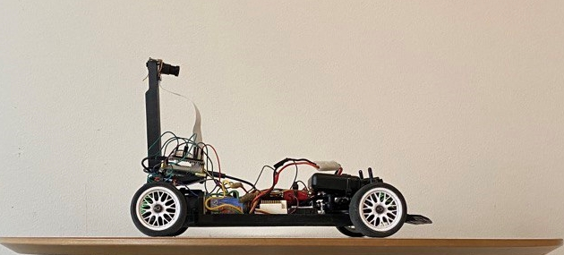
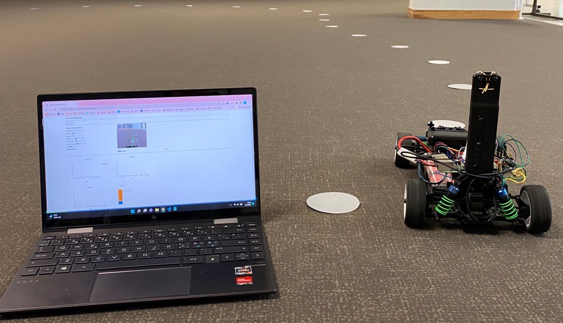

# Very simple autonomous RC car
This repository holds code for the autonomous RC-car project. The project is written in Python (Arduino part C++). Driving is based on following cookies on the floor, and the Driver agent is using Neural Network to calculate actions based on inputs.  More information about the project and code can be found from the project blog.

## Hardware components:
  - Kyosho Electric on-road RC car
  - Raspberry Pi model 4
  - Pi camera
  - Arduino Nano
  - Rotary encoder
  - Xbox360 controller and the USB-dongle
  - Power bank
  - Some wires, resistors, etc
## Software content:
  - Computer Vision/Image processing for finding dem cookies on the floor
  - Drive control
    - RasPi PWM for motor and servo control
    - Arduino code for speed detection with an encoder + battery voltage measurement
    - Driver agent selection
  - MySql database logging for data collection
  - Web server and dashboard
    - Real time camera stream
    - Metrics plotting
    - Parameter controlling
  - Efficient Neural Network for real time output calculations
  - Simulator trained Neural Network agent
  - Xbox controller code
